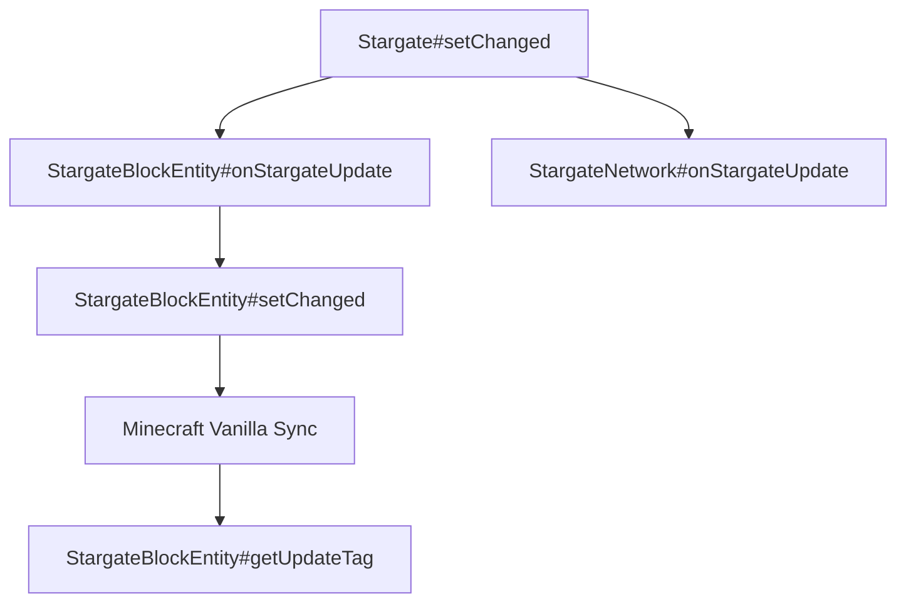

## a few important tech notes about the architecture

```mermaid
flowchart TD
    A[Stargate#setChanged] --> B[StargateBlockEntity#onStargateUpdate]
    B --> B1[StargateBlockEntity#setChanged]
    B1 --> C[Minecraft Vanilla Sync]
    C --> D[StargateBlockEntity#getUpdateTag]
    A --> E[StargateNetwork#onStargateUpdate]
```

WARN: OUTDATED